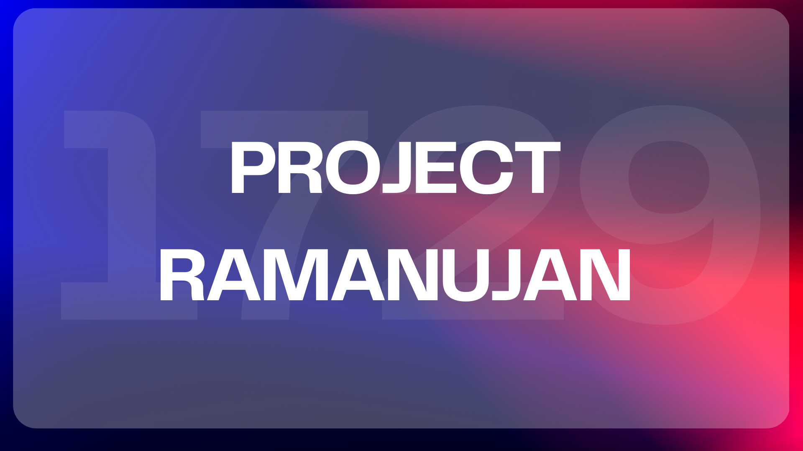

# Project Ramanujan (InfinityQ): AI Mathematical Intuition Engine ♾️🧠💡

[](https://opensource.org/licenses/MIT)
[](https://github.com/vinayak1729-web/PROJECT-RAMANUJAN)
<!-- Add other relevant badges as needed: Build Status, Version, etc. -->

**An open-source initiative to build an Artificial Intelligence capable of deep mathematical reasoning and intuitive problem-solving, inspired by the genius of Srinivasa Ramanujan and the efficiency of Vedic Mathematics.**

 

**Our goal is not just to find answers, but to discover the most elegant, efficient, and insightful solution paths, mimicking human intuition through structured, iterative reasoning.**

**Quick Links:**
*   **GitHub Repository:** [https://github.com/vinayak1729-web/PROJECT-RAMANUJAN](https://github.com/vinayak1729-web/PROJECT-RAMANUJAN)
*    **Kaggle Notebook:** [https://www.kaggle.com/code/vinu1729/project-ramanujan](https://www.kaggle.com/code/vinu1729/project-ramanujan)


---

## 🌟 Vision: Beyond Calculation, Towards Intuition

Standard computation excels at predefined algorithms. **Project Ramanujan (InfinityQ)** aims for a deeper level of AI cognition: mathematical *intuition*. We draw inspiration from Srinivasa Ramanujan's uncanny ability to perceive profound mathematical patterns and from the elegant, efficient techniques of Vedic Mathematics.

This project focuses on developing an AI that can:

1.  **Deeply Understand:** Move beyond surface syntax to grasp the core concepts of a mathematical problem.
2.  **Recognize Patterns:** Actively identify underlying structures, problem archetypes, and applicable mathematical motifs.
3.  **Strategize Effectively:** Evaluate diverse solution paths, weighing their suitability and potential efficiency.
4.  **Seek Elegance:** Prioritize concise, insightful methods reminiscent of Ramanujan's findings and Vedic sutras.
5.  **Verify Rigorously:** Employ multi-stage verification, including cross-checking with different approaches, to ensure accuracy.

This is an **open-source initiative** calling for collaboration among AI researchers, mathematicians, software developers, and anyone excited by the fusion of artificial intelligence and advanced mathematical reasoning.

---

## 🧬 Methodology: The InfinityQ Iterative Reasoning & Verification Cycle

Central to Project Ramanujan is a unique, multi-stage dialogue designed to guide Large Language Models (LLMs) like **Gemma 3** towards rigorous and insightful solutions. This **Iterative Reasoning & Verification Cycle** breaks down problem-solving into distinct, prompted phases:

**Phase 1: Structured Reasoning & Strategy (5 Steps)**

The AI is guided through a sequential analysis:

1.  **`STEP 1: ANALYZE PROBLEM (Givens, Goal, Type)`**
    *   **Objective:** Extract all explicit/implicit information. Define the target objective. Classify the mathematical domain (Algebra, Number Theory, Geometry, etc.).
2.  **`STEP 2: IDENTIFY SOLUTION PATTERNS`**
    *   **Objective:** Brainstorm potential recurring structures, known problem forms, or mathematical patterns applicable to this specific problem. Go beyond standard textbook methods.
3.  **`STEP 3: LIST TECHNIQUES (Theorems, Vedic Maths)`**
    *   **Objective:** Enumerate relevant mathematical theorems, standard techniques, formulas, and potentially applicable **Vedic Maths** sutras or shortcuts relevant to the problem type and identified patterns. Build context brick-by-brick.
4.  **`STEP 4: ASSESS TECHNIQUE SUITABILITY`**
    *   **Objective:** Evaluate the listed techniques. Estimate the likelihood ('probability') that each approach will lead to an efficient and correct solution based on the problem's characteristics.
5.  **`STEP 5: EXECUTE BEST-FIT TECHNIQUE (Brick-by-Brick)`**
    *   **Objective:** Select the technique deemed most suitable in Step 4. Apply the method systematically, showing clear, logical steps. Prioritize conciseness and leverage Vedic Maths insights where appropriate.

**Phase 2: Initial Solution Verification (Step 6)**

6.  **`STEP 6: PRELIMINARY VALIDATION`**
    *   **Objective:** Before accepting the result from Step 5, perform an initial sanity check. Does the logic flow correctly? Are all mathematical rules and constraints respected? Does the result seem plausible?

**Phase 3: Multi-Approach Cross-Verification**

*   **`RE-SOLVE & VERIFY x3 (Diverse Approaches)`**
    *   **Objective:** Generate the final answer **three separate times**. For each attempt, *force the use of a different valid technique* identified earlier (if possible). This acts as a powerful cross-check against method-specific errors.
*   **`CONVERGENCE CHECK (Mode Calculation)`**
    *   **Objective:** Compare the three answers. The proposed final answer is the **mode** (most frequent result). Significant divergence indicates high uncertainty or errors in one or more approaches.

**Phase 4: Final Detailed Audit**

*   **`FINAL RIGOROUS CHECK`**
    *   **Objective:** Take the modal answer. Conduct one last, meticulous verification pass, tracing the logic of the primary method that produced the modal answer. Ensure perfect alignment with all relevant formulas, rules, and mathematical principles.

**Guiding Principles (Embedded in Prompts):**

*   **Efficiency & Insight:** Explicitly request summarized forms, clever tricks, Vedic Maths, and "thinking like Srinivasa Ramanujan."
*   **Output Constraint:** Mandate the final answer as an integer **modulo 1000**.
*   **Pattern-Centricity:** The methodology inherently steers the AI towards pattern recognition (Step 2) and strategic assessment (Step 4) over brute force.

**Training Philosophy:** Future fine-tuning will emphasize **understanding over memorization**. We aim to train models on the *diversity of solution patterns*, the elegance of proofs, common pitfalls, and the strategic application of techniques (including Vedic Maths), rather than sheer volume of question-answer pairs.

---

## ✨ Core Features (Current & Planned)

*   ✅ **Iterative Reasoning Core:** Implements the detailed 5+1+3+1 step prompting cycle concept. *(Note: Current script uses a streamlined iterative flow).*
*   ✅ **Gemma 3 Powered:** Targets powerful models like Google's Gemma 3 27b-it (as reflected in the default script path).
*   ✅ **Ramanujan & Vedic Maths Inspired Prompts:** Explicitly guides the AI towards intuitive leaps and efficient techniques within the methodology.
*   ✅ **Multi-Approach Verification Concept:** Designed for robustness through cross-checking solutions. *(Note: Current script focuses on single iterative pass, multi-approach is a key development goal).*
*   ✅ **Modulo 1000 Output:** Standardized answer format.
*   ✅ **Open Source Codebase:** Available on GitHub for community development ([vinayak1729-web/PROJECT-RAMANUJAN](https://github.com/vinayak1729-web/PROJECT-RAMANUJAN)).
*   🅿️ **Refined Iterative Implementation:** Fully implementing the 5+1+3+1 cycle with distinct logic for each verification stage.
*   🅿️ **Pattern-Focused Fine-Tuning:** Planned fine-tuning using PEFT/LoRA on curated datasets emphasizing *how* problems are solved.
*   🅿️ **Reinforcement Learning (RL) for Verification & Guidance:** Planned integration of RL agents to reward valid reasoning, penalize errors, and guide technique selection.
*   🅿️ **Unsupervised Learning (UL) for Pattern Discovery:** Planned use of UL to autonomously identify novel mathematical patterns from data.
*   🅿️ **Advanced Verification Modules:** Future integration with symbolic math engines or code execution.

*(✅ = Implemented/Partially Implemented in concept/base, 🅿️ = Planned)*

---

## 🛠️ Technology Stack

*   **Language:** Python 3
*   **Core AI Model (Target/Default):** Gemma 3 27b-it (or other capable instruction-tuned LLMs)
*   **Core Libraries:**
    *   `transformers` (Hugging Face)
    *   `torch` (PyTorch) >= 2.0
    *   `numpy`
    *   `accelerate` (for efficient model loading/distribution)
*   **Planned Additions:**
    *   PEFT/LoRA libraries (`peft`)
    *   RL libraries (`trl` - Transformer Reinforcement Learning)
    *   UL/Embedding libraries (e.g., `sentence-transformers`, `scikit-learn`)
    *   Symbolic Math libraries (e.g., `sympy`)

---

## 🚀 Getting Started (Using the Python Script)

1.  **Prerequisites:**
    *   Python 3.9+
    *   Git
    *   GPU Highly Recommended (esp. for 27b models)
2.  **Clone the Repository:**
    ```bash
    git clone https://github.com/vinayak1729-web/PROJECT-RAMANUJAN.git
    cd PROJECT-RAMANUJAN
    ```
3.  **Set up Environment:**
    ```bash
    python -m venv venv
    source venv/bin/activate # On Windows: venv\Scripts\activate
    pip install -r requirements.txt # Create/update requirements.txt
    ```
    *Minimal `requirements.txt`:*
    ```
    torch
    transformers
    numpy
    accelerate
    ```
4.  **Download Model:**
    *   Obtain weights for **Gemma 3 27b-it** (or your chosen model). The script defaults to `/kaggle/input/gemma-3/transformers/gemma-3-27b-it/1`.
    *   If running locally, download the model (e.g., from Hugging Face Hub) and update the `DEFAULT_MODEL_PATH` in the script or use the `--model_path` argument.
5.  **Run the Solver:**
    *   Ensure the script (e.g., `ramanujan_gemma_solver.py`) is present.
    *   Execute from your terminal:
    ```bash
    # Using default model path (if available in environment like Kaggle)
    python ramanujan_gemma_solver.py -p "Your math problem here..."

    # Specifying local model path and showing reasoning
    python ramanujan_gemma_solver.py \
        --problem "What is the last digit of 7^(7^7)?" \
        --model_path ./models/gemma-3-27b-it \
        --show_reasoning

    # View all options
    python ramanujan_gemma_solver.py --help
    ```

---

## 🗺️ Roadmap: The Path to Intuition

*   **Phase 1: Foundational Engine & Enhanced Iteration (Q4 2024)**
    *   [✅] Establish core script structure (Gemma 3 target).
    *   [✅] Implement initial iterative prompting flow.
    *   [ ] **Refine Implementation:** Fully realize the 5+1+3+1 verification cycle logic within the code.
    *   [ ] Develop robust baseline evaluation metrics against math benchmarks.
*   **Phase 2: Pattern-Focused Fine-Tuning (Q1-Q2 2025)**
    *   [ ] Curate datasets emphasizing solution *methods*, Vedic techniques, patterns, and common errors.
    *   [ ] Implement PEFT/LoRA fine-tuning pipeline for Gemma 3 / other models.
    *   [ ] Train and evaluate models tuned for pattern recognition and strategic solving.
*   **Phase 3: Reinforcement Learning Integration (Q2-Q3 2025)**
    *   [ ] Define RL environment (state, action, reward) for step validity, efficiency, and strategic choice.
    *   [ ] Implement RL agent (e.g., PPO via `trl`) interacting with the fine-tuned LLM.
    *   [ ] Develop automated/semi-automated reward signals.
*   **Phase 4: Unsupervised Pattern Discovery (Q3-Q4 2025)**
    *   [ ] Implement pipeline for generating problem/solution embeddings.
    *   [ ] Apply UL techniques (clustering, etc.) to identify latent structures/heuristics.
    *   [ ] Integrate discovered patterns into prompts or RL rewards.
*   **Phase 5: Advanced Verification & Optimization (Ongoing)**
    *   [ ] Explore integration with symbolic math tools (SymPy).
    *   [ ] Investigate code execution verification.
    *   [ ] Optimize inference speed and resource usage (quantization, etc.).
*   **Phase 6: Community Building & Refinement (Ongoing)**
    *   [ ] Enhance documentation (`CONTRIBUTING.md`).
    *   [ ] Foster active community engagement via Issues and Discussions.
    *   [ ] Iterate on all components based on feedback and evaluation.

---

## 🤝 Contributing

**Collaboration is the cornerstone of Project Ramanujan!** We actively seek contributions from individuals passionate about:

*   **AI/ML:** LLM Fine-tuning (PEFT/LoRA), RL (PPO, Reward Modeling), NLP, Prompt Engineering.
*   **Mathematics:** Olympiad Math, Abstract Algebra, Number Theory, Geometry, Combinatorics, **Vedic Mathematics**.
*   **Software Engineering:** Python, API Design, Testing, MLOps, Performance Optimization.

**How to Get Involved:**

1.  **Fork & Clone:** `git clone https://github.com/vinayak1729-web/PROJECT-RAMANUJAN.git`
2.  **Explore Issues:** Look for open issues, especially those tagged `help wanted` or `good first issue`.
3.  **Discuss Ideas:** Open a new issue or join/start a Discussion to propose features, discuss methodology, or ask questions.
4.  **Submit PRs:** Create a branch for your changes and submit a Pull Request for review. Adherence to coding standards (detailed in `CONTRIBUTING.md` soon) is appreciated.
5.  **Improve Docs:** Help us make the project clearer and more accessible.

Let's maintain a respectful, innovative, and collaborative environment.

---

## 📜 License

This project is distributed under the **MIT License**. See the [LICENSE](./LICENSE) file for details.

---

## 🙏 Acknowledgements

*   The singular genius of **Srinivasa Ramanujan**.
*   The ancient wisdom and efficiency of **Vedic Mathematics**.
*   **Google** for the Gemma model series.
*   The **Hugging Face** ecosystem (`transformers`, `peft`, `trl`, `accelerate`).
*   The **Open Source community** that enables such ambitious projects.
*   **You** - our potential future collaborators!

---

**Join us in building an AI that doesn't just compute, but truly *understands* and *intuits* mathematics. Let's explore the infinite possibilities together!**
